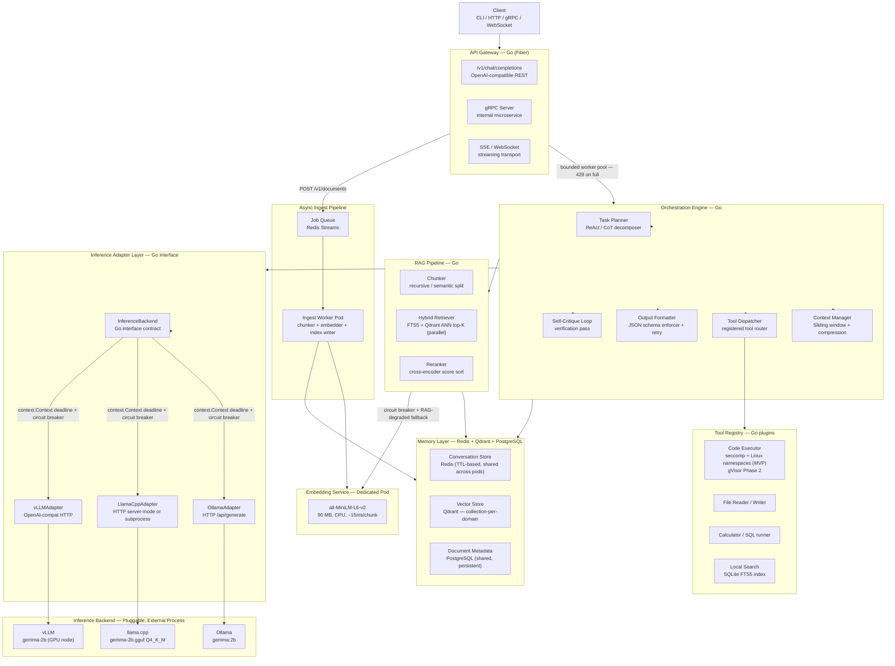
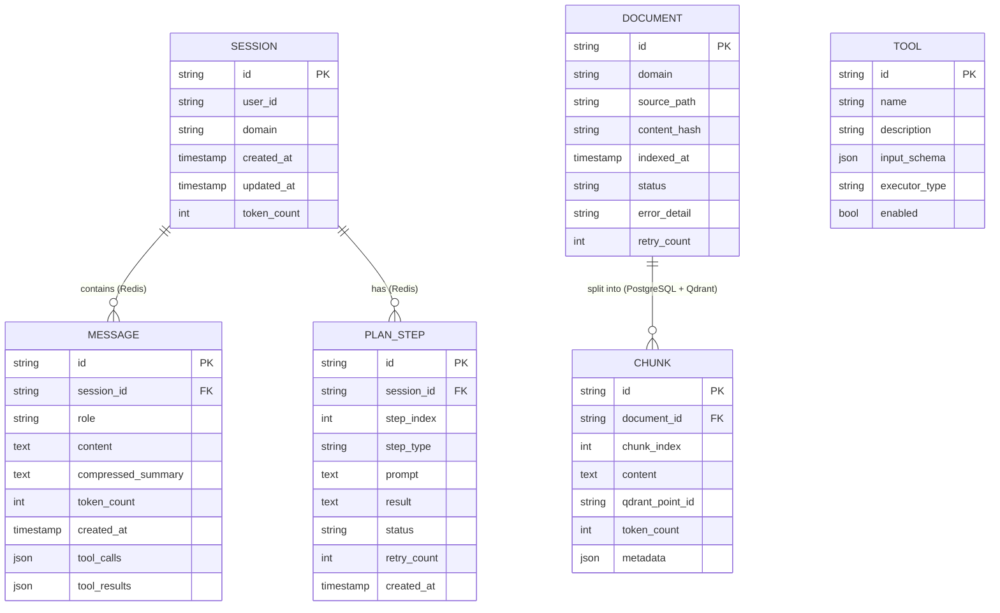

# Capability Amplification Wrapper (CAW) — Architecture

**Document status:** Production-Ready v1.1 — Audit fixes applied (CR-1 through CR-5, EG-1, EG-3, EG-4, EG-6, CR-A through CR-E, EG-A through EG-E, CR-F through CR-Q, EG-F through EG-O)
**Date:** 2026-04-20
**Author:** Senior Architect & Delivery Lead

---

## Executive Summary

The **Capability Amplification Wrapper (CAW)** is a stateless Go service that transforms a small local model (e.g., `gemma:2b`) into a system capable of multi-step reasoning, long-context handling, structured output, RAG-backed factual retrieval, and tool calling — without modifying the underlying model. The inference backend is fully decoupled via an adapter interface; Ollama, llama.cpp, and vLLM are interchangeable. The system is designed to run on minimal hardware (starting at a $24 Droplet, 4 GB RAM) and scale horizontally to Kubernetes with KEDA-managed serverless pods.

**North Star metric:** Close ≥ 60% of the capability gap between `gemma:2b` baseline and GPT-3.5 on MMLU, HumanEval, and domain-specific benchmarks — 100% offline, 100% local.

---

> **Assumption A:** The $6/mo Droplet (1 GB RAM) hosts the wrapper service only. `gemma:2b Q4_K_M` requires ~1.5–2 GB RAM — inference must run on a dedicated node with ≥ 4 GB RAM. The wrapper pod is fully stateless (no embedded DB) and fits in < 50 MB.
>
> **Assumption B:** "100% local/offline" means no egress to commercial APIs. Internet access is permitted for K8s control plane and initial model pull only.
>
> **Assumption C:** Sub-3s interactive SLA is achievable via **streaming first-token** + aggressive output token budgeting (≤ 256 tokens/response for interactive turns). Full-reasoning multi-step tasks are async.
>
> **Assumption D:** The embedding service (`all-MiniLM-L6-v2`, 90 MB) runs as a dedicated sidecar/pod, separate from the inference backend, to avoid RAM contention with `gemma:2b`.
>
> **Assumption E:** Document ingest is always processed asynchronously via a Redis Streams job queue — never on the interactive request goroutine.

---

## Deliverable 1 — High-Level Architecture (HLA)

### Component Map



### Data Flow — Critical Path (Interactive Chat Request)

```
1.  Client POST /v1/chat/completions  →  API Gateway
2.  Gateway authenticates (API key / mTLS), deserialises request.
    Distributed rate limiter: INCR caw:rate:{api_key}:{window_ts} — if count > 60 → HTTP 429.
    Bounded worker pool check: if pool full → HTTP 429 immediately.
3.  ContextManager loads conversation history from Redis (shared, pod-agnostic),
    applies sliding-window compression if > 3K tokens
    [Compression is atomic: Redis Lua script (or SET NX lock on session:{id}:compressing, TTL 2s)
     prevents TOCTOU race when concurrent requests arrive on the same session_id.
     Losers wait ≤ 500ms for the lock to release; on timeout, apply hard-truncation
     (drop oldest messages until token_count ≤ 2.5K) — never proceed with uncompressed 3K+ context]
4.  TaskPlanner classifies intent:
    simple-generate | structured-output | agent-loop | rag-query
5.  [RAG branch] Query embedding checked in in-process LRU cache (SHA256(text), TTL 5 min, 1K entries).
    Cache miss → request sent to EmbedSvc (dedicated pod); EmbedSvc gRPC client has circuit breaker:
    3 consecutive failures → open 30s → RAG-degraded mode: no context injected, x-caw-rag-degraded: true header.
    [RAG-degraded + domain IN (legal, medical)] Auto-trigger critique pass at step 10
    regardless of agent_mode — ungrounded responses in high-stakes domains are not safe to serve.
    [Retrieval cache] Cache key = (domain, query_hash, caw:retrieval:{domain}:version) checked in
    Redis (TTL 60s); version read via GET before constructing key (O(1));
    cache miss →
    Qdrant ANN search (domain collection) + PostgreSQL FTS BM25 run IN PARALLEL via errgroup,
    each leg wrapped with context.WithTimeout(ctx, 300ms); if one leg times out, use the other
    leg's results alone (single-source degraded mode); timeout counted as
    caw_retrieval_leg_timeout_total{leg="ann|fts"} →
    merge via reciprocal rank fusion (RRF).
    [Interactive turn, agent_mode=false] Skip cross-encoder reranker; use RRF scores → top-5 → inject as [CONTEXT] block.
    [agent_mode=true / async tasks] Full cross-encoder Reranker applied after RRF merge → top-5 → inject.
6.  Planner builds system prompt
    (domain persona + CoT scaffold + retrieved context + tool manifest +
     JSON grammar/schema constraint injected directly for structured-output tasks)
7.  InferenceAdapter.Generate(prompt, constraints) → active backend (streaming)
    [context.Context with hard 25s deadline; circuit breaker trips after 3 timeouts]
8.  [Structured output] Grammar-constrained generation produces valid JSON natively.
    OutputFormatter validates; on violation → correction prompt → retry ≤ 1×
    (retry is exception, not default path)
9.  [Tool call detected] ToolDispatcher executes tool via seccomp + Linux namespaces sandbox
    with cgroup v2 resource limits (256 MB memory, 0.5 CPU) enforced via cgexec;
    appends result, re-enters step 7
10. Self-Critique pass if x-caw-options.critique=true
    OR domain in [legal, medical] OR tool call wrote external state
    OR (x-caw-rag-degraded=true AND domain in [legal, medical])
    [Non-agent-loop requests skip critique unless one of the above conditions is met]
11. Response streamed token-by-token via SSE to client;
    ConvStore updated in Redis with TTL

Document Ingest (async — never on request goroutine):
A.  Client POST /v1/documents  →  Gateway enqueues job to Redis Streams → HTTP 202
B.  IngestWorker pod consumes job: chunk → embed (EmbedSvc, concurrency capped at EMBED_CONCURRENCY=4
    per worker pod via semaphore) → write to Qdrant first, then PostgreSQL using
    INSERT ... ON CONFLICT (content_hash) DO NOTHING (dedup enforced at DB level).
    [Write ordering] If PostgreSQL insert fails after Qdrant write succeeds, the Qdrant point
    is orphaned but unreachable (no chunks row → never returned by retriever). A periodic
    reconciliation job compares Qdrant point IDs against chunks table and purges orphans.
    On ingest completion: increment domain-level version counter
    (INCR caw:retrieval:{domain}:version) — O(1), non-blocking. Cache keys embed the
    version, so old entries expire naturally via TTL. SCAN+DEL is prohibited
    (O(N) over full keyspace — blocks Redis under large key counts).
C.  Failed chunks → dead-letter stream with retry metadata; max_retry_count = 3;
    on exhaustion → document status set to 'failed' in PostgreSQL.
    caw_ingest_dlq_depth Prometheus gauge monitored; alert fires when depth > 10.
    Client polls /v1/documents/{id}/status
```

### Tech Stack Decision Matrix

| Layer | Choice | Latency / Throughput / Cost Justification | Trade-offs |
|---|---|---|---|
| **Wrapper Runtime** | Go 1.22 | Sub-ms goroutine scheduling; single static binary; ~5 MB image; zero GC pauses at this scale | Ecosystem smaller than Python for ML tooling |
| **HTTP Transport** | Fiber v2 (fasthttp) | 2–3× lower P99 vs net/http at 1K RPS; zero-alloc routing | Non-standard net/http adapter needed for some middleware |
| **Internal RPC** | Go interfaces (intra-process); gRPC only for cross-pod boundary (wrapper → embed service pod) | Eliminates serialisation overhead and proto boilerplate for same-process calls; saves ~2–5 ms/request | Tool execution is intra-process subprocess (seccomp + cgexec), not a separate gRPC pod; gRPC tool executor pod is a Phase 3 hardening option only |
| **Inference Abstraction** | Go interface + adapters | Zero coupling; swap backend with env var; adapter = ~100 LOC each | Manual adapter per new backend |
| **Session / Conv Store** | Redis (shared, TTL-based) | Sub-ms reads; shared across all wrapper pods; eliminates session routing collision; survives pod eviction | Client-side command timeout ≤ 10 ms with retry-backoff enforced; `caw_redis_latency_seconds` Prometheus histogram tracked; alert on p99 > 5 ms |
| **Vector Search** | Qdrant (standalone pod, collection-per-domain) | Domain isolation enforced at collection level; prevents knowledge leakage; scales independently; ANN ~2 ms at 1M vectors | Separate process; adds operational surface |
| **Document Metadata** | PostgreSQL (persistent volume) | ACID, shared writer, supports concurrent pods; FTS5 extension for BM25 on same connection | Heavier than SQLite; required for multi-pod correctness |
| **Embeddings** | all-MiniLM-L6-v2 (dedicated pod) | 90 MB vs 270 MB for nomic; ~15 ms/chunk CPU; zero RAM contention with gemma:2b; 384-dim vectors sufficient for retrieval | Lower max context (512 tokens) vs nomic (8192); chunk size must stay ≤ 400 tokens |
| **Embedding Cache** | In-process LRU (SHA256 key, TTL 5 min, 1K entries, ~1.5 MB) | Eliminates EmbedSvc gRPC round-trip (~15 ms) for hot/repeated queries; zero external dependency | Stale embeddings during corpus re-index; acceptable given short TTL |
| **Retrieval Cache** | Redis (`(domain, query_hash)` key, TTL 60 s, ~2 KB/entry) | Eliminates full RAG pipeline (~50–200 ms) for repeated hot queries within TTL window | Stale context if corpus updated within TTL; acceptable for interactive turns |
| **BM25 Index** | PostgreSQL FTS (`tsvector` + `GIN on content`) | Already co-located with document metadata (same instance); ACID-consistent; sub-5 ms at < 10K docs; eliminates separate SQLite process | Replace with bluge only if FTS recall degrades at > 10K documents (measure first) |
| **Document Chunking** | Go custom (recursive + semantic) | Tunable chunk size; no Python subprocess | Must maintain Python parity for quality |
| **Containerisation** | Docker scratch image | Final image < 15 MB (Go static binary) | No shell for debugging; use distroless for debug builds |
| **Orchestration** | Kubernetes + KEDA | Scale-to-zero on queue depth; horizontal wrapper scaling; stateless round-robin (Redis holds all session state — sticky session routing not needed) | Inference backend must be separately deployed |
| **Tool Sandbox (MVP)** | seccomp + Linux user namespaces + cgroup v2 limits | < 10 ms overhead vs 200–500 ms for gVisor cold-start; cgroup v2 caps subprocess at 256 MB / 0.5 CPU — prevents fork-bomb / infinite-loop from exhausting node resources | Less strict than gVisor; harden to gVisor in Phase 2 |
| **Ingest Queue** | Redis Streams | Durable, replayable, dead-letter support; same Redis instance as session store | Requires consumer group management |
| **Observability** | OpenTelemetry + Prometheus | Vendor-neutral; native Go SDK; zero external dependency | Requires Grafana/Prom stack in K8s |

### Required Prometheus Metrics Catalogue

The following metrics MUST be exported by the wrapper service. Names are canonical — KEDA triggers and alert rules reference these exact strings.

| Metric | Type | Labels | Description |
|---|---|---|---|
| `caw_requests_in_flight` | Gauge | — | Current count of requests held in the worker pool; KEDA wrapper scaler trigger |
| `caw_redis_latency_seconds` | Histogram | `operation` | Per-command Redis round-trip time; alert p99 > 5 ms |
| `caw_ingest_dlq_depth` | Gauge | — | Pending entries in dead-letter stream; alert > 10 |
| `caw_retrieval_leg_timeout_total` | Counter | `leg` (`ann`\|`fts`) | Count of 300ms retrieval timeouts per leg |
| `caw_rag_degraded_total` | Counter | `domain` | Requests served in RAG-degraded mode |
| `caw_critique_pass_total` | Counter | `trigger` (`opt_in`\|`auto_legal`\|`auto_medical`\|`rag_degraded`\|`side_effect`) | Self-critique pass invocations by trigger type |

---

## Deliverable 2 — Data Schema

### Workload Classification: OLTP + Hybrid (RAG = OLAP-lite)

### Storage Tier Map

| Data | Store | Reason |
|---|---|---|
| Session metadata + conversation history | **Redis** (Hash + List per session, TTL) | Sub-ms, shared across pods, survives pod eviction |
| Document metadata + tool definitions | **PostgreSQL** (persistent volume) | ACID, shared writer, concurrent pod access |
| Vector embeddings | **Qdrant** (collection-per-domain) | ANN search, domain isolation, scales independently |
| Ingest job queue + dead-letter | **Redis Streams** | Durable, replayable, same Redis instance |

### Entity Relationship Diagram



> **Document Deletion:** Deleting a document is a two-step operation enforced at the application layer:
> 1. Fetch all `qdrant_point_id` values from `chunks WHERE document_id = ?`
> 2. Delete those points from Qdrant collection `caw_{domain}`
> 3. `DELETE FROM documents WHERE id = ?` (cascades to chunks via ON DELETE CASCADE)
> Never execute step 3 before steps 1–2. ON DELETE CASCADE alone will orphan Qdrant vectors.
> The reconciliation CronJob (daily) also purges any Qdrant points with no matching chunks row.
```

### Schema Definitions

#### Redis Key Structure (Session Store)

```
session:{id}          → Hash: user_id, domain, created_at, updated_at, token_count
session:{id}:messages → List: JSON-encoded message objects, hard-capped at 200 entries.
                        Every write uses a pipeline: RPUSH + LTRIM session:{id}:messages 0 199
                        Do NOT use bare RPUSH — lists are unbounded without LTRIM.
session:{id}:steps    → List (RPUSH): JSON-encoded plan_step objects

TTL: 24h on all session keys (sliding window — reset on each access)

Redis Configuration:
  maxmemory-policy: noeviction   # Never evict keys; return OOM error instead
  maxmemory: <80% of available RAM>  # Alert fires at 80% utilisation
  # Rationale: allkeys-lru would silently evict active session keys mid-conversation.
  # Retrieval cache keys (caw:retrieval:*) use a version-counter namespace so natural
  # TTL expiry handles their lifecycle; noeviction is safe here.
  # Prometheus alert: redis_memory_used_bytes / redis_memory_max_bytes > 0.80
```

#### PostgreSQL DDL (Document Metadata + Tools)

```sql
CREATE TABLE documents (
    id            TEXT PRIMARY KEY,
    domain        TEXT        NOT NULL,
    source_path   TEXT        NOT NULL,
    content_hash  TEXT        NOT NULL UNIQUE,
    indexed_at    TIMESTAMPTZ NOT NULL DEFAULT now(),
    status        TEXT        NOT NULL DEFAULT 'pending'
                              CHECK(status IN ('pending','processing','indexed','failed')),
    error_detail  TEXT,
    retry_count   INTEGER     NOT NULL DEFAULT 0
);
-- Ingest dedup: all document inserts MUST use upsert semantics:
--   INSERT INTO documents (...) ON CONFLICT (content_hash) DO NOTHING RETURNING id
-- Application-level pre-checks are insufficient under concurrent ingest workers (TOCTOU race).

CREATE TABLE chunks (
    id              TEXT PRIMARY KEY,
    document_id     TEXT        NOT NULL REFERENCES documents(id) ON DELETE CASCADE,
    chunk_index     INTEGER     NOT NULL,
    content         TEXT        NOT NULL,
    qdrant_point_id TEXT        NOT NULL,  -- UUID of point in Qdrant collection
    token_count     INTEGER     NOT NULL,
    metadata        JSONB
);

CREATE TABLE tools (
    id             TEXT PRIMARY KEY,
    name           TEXT    NOT NULL UNIQUE,
    description    TEXT    NOT NULL,
    input_schema   JSONB   NOT NULL,
    executor_type  TEXT    NOT NULL CHECK(executor_type IN ('builtin','subprocess','http')),
    enabled        BOOLEAN NOT NULL DEFAULT true
);
```

#### Qdrant Collection Schema (per domain)

```json
{
  "collection_name": "caw_{domain}",
  "vectors": { "size": 384, "distance": "Cosine" },
  "payload_schema": {
    "chunk_id":     "keyword",
    "document_id":  "keyword",
    "domain":       "keyword",
    "content":      "text",
    "token_count":  "integer"
  }
}
```

> **Security:** All Qdrant queries MUST include `filter: { must: [{ key: "domain", match: { value: "{request_domain}" } }] }` — enforced in the retriever layer, never delegated to the caller.

### Indexing Strategy

| Store | Index | Query Pattern |
|---|---|---|
| PostgreSQL `chunks` | `(document_id, chunk_index)` | Ordered chunk reconstruction |
| PostgreSQL `documents` | `(domain, status)` | Domain-filtered ingestion queue |
| PostgreSQL `documents` | `UNIQUE on content_hash` | Deduplication on ingest |
| PostgreSQL `chunks` | `GIN on content` (pg_trgm or FTS) | BM25-style keyword retrieval |
| Qdrant `caw_{domain}` | HNSW index on 384-dim vectors | ANN similarity search for RAG |
| Redis session keys | Hash field access by key | O(1) session/message retrieval |

### Partitioning & Sharding Strategy

**Single-node (MVP):** PostgreSQL single-instance with direct connections (PgBouncer deferred to Phase 2 — add when Prometheus alert `pg_stat_activity_count > 50` fires); Qdrant single-node with one collection per domain.

**K8s scale-out:** Qdrant distributed mode (sharding per collection); PostgreSQL read replicas for chunk content queries. Redis Cluster if session volume exceeds single-instance capacity (> 100K concurrent sessions).

> **Security:** Domain knowledge leakage between tenants is a critical risk. Qdrant collection-per-domain is the primary isolation boundary. All retrieval queries carry a mandatory domain filter enforced in Go — never passed from client input directly.

---

## Deliverable 3 — API Design

### Protocol Choice

**Primary:** OpenAI-compatible REST (JSON over HTTP/1.1 + SSE streaming).
Every major client (curl, Python openai SDK, VS Code extensions, LangChain) speaks this protocol. Zero client-side changes to swap in the wrapper.

**Internal:** Go interfaces for intra-process calls. gRPC used only at the wrapper → embedding service pod cross-pod boundary. Tool execution is an intra-process subprocess (seccomp + cgexec); a separate gRPC tool executor pod is a Phase 3 hardening option only.

### Contract — Critical Endpoints (OpenAPI 3.1)

```yaml
openapi: "3.1.0"
info:
  title: Capability Amplification Wrapper API
  version: "1.0"

paths:
  /v1/chat/completions:
    post:
      summary: OpenAI-compatible chat endpoint
      requestBody:
        required: true
        content:
          application/json:
            schema:
              type: object
              required: [model, messages]
              properties:
                model:       { type: string, example: "gemma:2b" }
                messages:    { type: array, items: { $ref: '#/components/schemas/Message' } }
                stream:      { type: boolean, default: false }
                temperature: { type: number, minimum: 0, maximum: 2 }
                max_tokens:  { type: integer, default: 256, maximum: 2048 }
                response_format:
                  type: object
                  properties:
                    type: { type: string, enum: [text, json_object] }
                tools:       { type: array, items: { $ref: '#/components/schemas/ToolDef' } }
                x-caw-options:
                  type: object
                  properties:
                    domain:       { type: string, enum: [general, legal, medical, code] }
                    rag_enabled:  { type: boolean, default: true }
                    agent_mode:   { type: boolean, default: false }
                    critique:     { type: boolean, default: false, description: "Enable self-critique pass. Auto-enabled for legal/medical domains and tool calls with side effects." }

  /v1/documents:
    post:
      summary: Enqueue document for async ingest
      requestBody:
        required: true
        content:
          application/json:
            schema:
              type: object
              required: [content, domain]
              properties:
                content:     { type: string }
                source_path: { type: string }
                domain:      { type: string, enum: [general, legal, medical, code] }
                metadata:    { type: object }
      responses:
        '202':
          description: Accepted — job enqueued to Redis Streams

  /v1/documents/{document_id}/status:
    get:
      summary: Poll async ingest job status

  /v1/sessions/{session_id}:
    delete:
      summary: Clear session memory

  /v1/tools:
    get:
      summary: List registered tools
    post:
      summary: Register a new tool

  /healthz:
    get:
      summary: Liveness probe

  /readyz:
    get:
      summary: Readiness probe — checks backend connectivity

  /metrics:
    get:
      summary: Prometheus metrics scrape endpoint
```

### Auth & Rate Limiting Strategy

| Concern | Mechanism |
|---|---|
| Authentication | Static API key via `Authorization: Bearer <key>`; key stored in env var / K8s Secret |
| mTLS (K8s internal) | Istio / Linkerd sidecar; wrapper pods only accept internal traffic without bearer token |
| Rate limiting | Distributed Redis counter (`INCR caw:rate:{api_key}:{window_ts}`, TTL = window); 60 req/min per API key; atomic O(1) Redis op within 10ms command budget; enforced at Gateway before worker pool — ineffective in-process per-pod bucket removed (20 pods × 60 = 1200 effective limit with per-pod bucket) |
| Request size | Max body 4 MB enforced at Fiber middleware layer |
| Tool sandbox (MVP) | seccomp profile + Linux user namespaces; < 10 ms overhead; no network egress from tool processes |
| Tool sandbox (Phase 2) | Upgrade to gVisor (`runsc`) for stronger syscall interception; only after SLA is proven on seccomp baseline |

> **Risk:** Single API key is not multi-tenant. For team deployment, implement JWT with claims for `domain` and `rate_limit_tier`.

### Versioning Strategy

URL path versioning: `/v1/`, `/v2/`. Breaking changes increment the major version. Non-breaking additions are additive within the same version. The OpenAI-compat surface is frozen at `v1` to avoid breaking existing clients.

---

## Deliverable 4 — IaC Strategy

### Cloud Provider & Region Strategy

| Tier | Provider | Rationale |
|---|---|---|
| MVP (local) | Single Droplet / bare metal | **$24/mo** node (4 GB RAM, 2 vCPU) minimum — 2 GB is insufficient (see Cost Estimate note) |
| Production | DigitalOcean Kubernetes (DOKS) or self-hosted k3s | Cost-optimised; no vendor lock-in |
| GPU inference node | Any CUDA node (Hetzner AX52, RunPod) as K8s worker | Attach when throughput SLA demands it |

**Region:** Single-region primary. DR strategy per store:
- **Redis:** AOF persistence + hourly RDB snapshot to MinIO. RPO = 1 min, RTO = 3 min.
- **PostgreSQL:** WAL archiving to MinIO every 5 min + daily pg_dump. RPO = 5 min, RTO = 5 min.
- **Qdrant:** Snapshot API triggered hourly to MinIO. RPO = 1 h, RTO = 10 min (snapshot restore).

### IaC Toolchain: Terraform + Helm

**Terraform** manages infrastructure (nodes, networking, storage volumes).
**Helm** manages K8s application manifests and enables GitOps via ArgoCD or Flux.

### Key Infrastructure Modules

```
terraform/
├── modules/
│   ├── networking/        # VPC, firewall rules, private subnet
│   ├── compute/           # K8s node pool definitions (wrapper pool, inference pool, embed pool)
│   ├── storage/           # Persistent volumes, MinIO for backup
│   ├── observability/     # Prometheus, Grafana, Loki stack
│   └── secrets/           # Sealed Secrets or Vault agent injector

helm/
├── caw-wrapper/           # Wrapper Deployment, HPA, Service, Ingress
│                          # Stateless round-robin load balancing; no sticky session annotation
├── inference-backend/     # Ollama / llama.cpp DaemonSet or Deployment (minReplicas: 1, keep-warm)
├── embed-service/         # all-MiniLM-L6-v2 Deployment (dedicated pod, separate resource quota)
├── ingest-worker/         # Async ingest worker Deployment (Redis Streams consumer group)
├── caw-reconciler/        # CronJob (daily) — purges orphaned Qdrant points with no chunks row
├── redis/                 # Redis Deployment with AOF persistence + PVC
├── postgresql/            # PostgreSQL StatefulSet with PVC (PgBouncer sidecar deferred to Phase 2)
├── qdrant/                # Qdrant Deployment with PVC (one collection per domain)
└── keda/                  # ScaledObject definitions
```

### Auto-Scaling Policy

```yaml
# KEDA ScaledObject — wrapper pods scale on in-flight request depth
apiVersion: keda.sh/v1alpha1
kind: ScaledObject
metadata:
  name: caw-wrapper-scaler
spec:
  scaleTargetRef:
    name: caw-wrapper
  minReplicaCount: 0       # scale-to-zero when idle
  maxReplicaCount: 20
  fallback:
    failureThreshold: 3
    replicas: 3            # hold 3 replicas if Prometheus is unavailable
  triggers:
  - type: prometheus
    metadata:
      serverAddress: http://prometheus:9090
      metricName: caw_requests_in_flight
      threshold: "5"       # 5 in-flight requests per replica
      query: sum(caw_requests_in_flight)
```

**Inference backend:** `minReplicaCount: 1` (keep-warm) to avoid cold-start on model load (~10 s for `gemma:2b`).

```yaml
# KEDA ScaledObject — ingest worker scales on Redis Streams consumer group lag
apiVersion: keda.sh/v1alpha1
kind: ScaledObject
metadata:
  name: caw-ingest-worker-scaler
spec:
  scaleTargetRef:
    name: caw-ingest-worker
  minReplicaCount: 0       # scale-to-zero when queue is empty
  maxReplicaCount: 10
  triggers:
  - type: redis-streams
    metadata:
      address: redis:6379
      stream: caw:ingest:jobs
      consumerGroup: ingest-workers
      pendingEntriesCount: "50"  # 50 pending messages per replica; ingest worker caps
                                   # EmbedSvc calls at 4 concurrent (EMBED_CONCURRENCY env var)
```

### Cost Estimate

| Scenario | Config | Est. Monthly Cost |
|---|---|---|
| MVP — local dev | 1× $24 Droplet (4 GB, 2 vCPU) — wrapper + inference + embed + Redis + PG | **$24/mo** |
| MVP — small team | 1× wrapper node ($6) + 1× inference node ($24, 4 GB) + 1× data node ($12, Redis+PG+Qdrant) | **$42/mo** |
| Production K8s | DOKS 3-node cluster ($36) + 1× inference node ($24) + 1× data node ($24) | **~$84/mo** |
| Scale-out (50 concurrent) | 5× wrapper pods (auto) + 2× inference replicas + Redis cluster + Qdrant distributed | **~$220/mo** |

> **Note:** Minimum viable single-node is a $24 Droplet (4 GB RAM). A 2 GB node cannot simultaneously host `gemma:2b` (~1.5 GB), `all-MiniLM-L6-v2` (~90 MB), Redis, PostgreSQL, and the Go wrapper with headroom for OS and request bursts.
> **Risk:** CPU-only `gemma:2b` inference at 5–15 tok/s will breach sub-3s SLA for responses > 45 tokens. Mitigation: stream first token (< 800 ms), cap interactive responses to 200 tokens, use async mode for agent loops.

---

## Deliverable 5 — Delivery Roadmap

### Phase 0 — Foundation (Weeks 1–3)

**Objectives:** Core skeleton, inference adapter, single-turn chat working end-to-end.

**Key Deliverables:**
- Go module scaffold (`cmd/`, `internal/adapter/`, `internal/api/`, `internal/engine/`, `internal/store/`)
- `InferenceBackend` interface + `OllamaAdapter` implementation with `context.Context` deadline + circuit breaker
- OpenAI-compat `/v1/chat/completions` endpoint (non-streaming)
- Redis session store + basic `ContextManager` (replace BoltDB entirely)
- Bounded worker pool at gateway (configurable depth, HTTP 429 on full)
- `/readyz` probe that marks ready once the inference backend's health endpoint returns 200 (no full inference round-trip — avoids blocking K8s scale-out for 10–30 s on pod startup)
- Docker image + `docker-compose.yml` (wrapper + Ollama + Redis + PostgreSQL + Qdrant)
- Unit tests: adapter mock, context window truncation, token counting, worker pool backpressure, circuit breaker state transitions, RPUSH+LTRIM list-cap enforcement (list never exceeds 200 after 250 writes), distributed rate limiter Redis counter

**Success Criteria:**
- `curl /v1/chat/completions` returns a valid response from `gemma:2b` via Ollama
- Docker image size < 20 MB
- P50 latency (excluding inference) < 50 ms
- Session data survives wrapper pod restart (verified via Redis)
- HTTP 429 returned when worker pool depth exceeded (load test with k6)

---

### Phase 1 — MVP Capability Stack (Weeks 4–8)

**Objectives:** RAG pipeline, tool calling, structured output, streaming.

**Key Deliverables:**
- Qdrant integration (collection-per-domain, mandatory domain filter on all queries)
- Embedding service pod (`all-MiniLM-L6-v2`, gRPC interface)
- Parallel hybrid retriever (Qdrant ANN + PostgreSQL FTS5 via `errgroup`)
- Async document ingest pipeline: Redis Streams enqueue → ingest worker → Qdrant + PostgreSQL
- Dead-letter stream + `/v1/documents/{id}/status` polling endpoint
- Distributed Redis rate limiter (`INCR caw:rate:{api_key}:{window_ts}`) replacing per-pod token bucket
- Qdrant–PostgreSQL reconciliation CronJob (`caw-reconciler/` Helm chart, daily, purges orphaned Qdrant points with no matching chunks row)
- `OutputFormatter` with grammar-constrained generation (Ollama `format:json` / llama.cpp grammar mode) as primary path; correction-prompt retry ≤ 1× as fallback
- Tool registry + `CodeExecutor` (seccomp + Linux namespaces) + `Calculator`
- SSE streaming transport
- `LlamaCppAdapter` (HTTP server mode)
- Helm chart v0.1 (includes redis, postgresql, qdrant, embed-service, ingest-worker charts)
- EmbedSvc gRPC client circuit breaker (3 consecutive failures → open 30 s) + RAG-degraded mode (`x-caw-rag-degraded: true` response header)
- In-process embedding LRU cache (SHA256 key, TTL 5 min, 1K entries, ~1.5 MB) on EmbedSvc client
- Retrieval result Redis cache (`(domain, query_hash)` key, TTL 60 s) — bypasses full RAG pipeline on hit
- Reranker gated to `agent_mode: true` and async tasks only; interactive turns use RRF merge scores directly

**Success Criteria:**
- RAG retrieval recall@5 ≥ 0.75 on 1K-chunk test corpus
- JSON schema output valid on first attempt ≥ 85% of requests (grammar-constrained path)
- Streaming first-token latency < 1 s (CPU inference, 128-token output)
- Document ingest: 0 chunk loss on ingest-worker pod restart (dead-letter verified)
- **OllamaAdapter and LlamaCppAdapter** pass integration test suite (vLLMAdapter stub compiled but not integration-tested until Phase 2)
- Code execution sandbox: no network egress from tool process (verified with `strace`)
- EmbedSvc circuit breaker verified: kill EmbedSvc pod mid-request → wrapper continues serving non-RAG requests with `x-caw-rag-degraded: true` (integration test)

---

### Phase 2 — Intelligence & Hardening (Months 3–4)

**Objectives:** Agent loops, multi-turn memory compression, domain personas, observability.

**Key Deliverables:**
- `TaskPlanner` (ReAct loop, max 5 steps, depth guard)
- Context compression (recursive summarisation at 3K token threshold) — atomic write via Redis Lua script (`SET NX session:{id}:compressing`, TTL 2 s) to prevent TOCTOU race under concurrent requests on same session
- Domain persona library (legal / medical / code / general prompt templates)
- Self-critique pass (structured confidence scoring) — conditional: opt-in via `x-caw-options.critique` or auto-triggered for legal/medical/side-effect tool calls
- OpenTelemetry traces + Prometheus metrics + Grafana dashboards
- KEDA auto-scaling deployed (wrapper: scale-to-zero; inference: minReplicas=1 keep-warm; ingest worker: scale-to-zero on Redis Streams consumer group lag)
- PgBouncer connection pooler for PostgreSQL (add when `pg_stat_activity_count > 50` Prometheus alert fires)
- `vLLMAdapter` implementation
- gVisor sandbox upgrade for `CodeExecutor` (replaces seccomp baseline)
- Load test suite (k6): 50 concurrent users, sub-3s P95 streaming

**Success Criteria:**
- Agent loop solves multi-step coding task (3–5 steps) end-to-end
- Context compression keeps token count < 3500 across 20-turn conversation
- P95 streaming first-token < 1 s under 20 concurrent users
- Self-critique adds < 800 ms overhead (verified via OTel trace spans)
- Zero data loss on pod eviction (Redis AOF + Qdrant snapshot restore verified)

---

### Phase 3 — North Star (Month 5+)

**Objectives:** Production-grade multi-tenant deployment, pluggable skill library, benchmark parity.

**Key Deliverables:**
- JWT multi-tenant auth with per-domain isolation
- Plugin system for community skill/tool contributions
- Quantitative benchmark: `gemma:2b` + wrapper vs GPT-3.5 on MMLU, HumanEval, and a custom domain benchmark
- Qdrant migration path for > 1M chunk corpora
- Serverless deployment guide (Knative / AWS Lambda container)
- Public Helm chart registry

**Success Criteria:**
- Wrapper closes ≥ 60% of capability gap between `gemma:2b` baseline and GPT-3.5 on target benchmarks
- 99.5% uptime over 30-day window
- Cold-start to first token < 5 s on scale-to-zero pod

---

### Risk Register

| Risk | Likelihood | Impact | Mitigation |
|---|---|---|---|
| CPU inference too slow for sub-3s SLA | **High** | High | Stream first token; cap to 200 output tokens; async mode for agent tasks; GPU node upgrade path |
| `gemma:2b` context window (8K) exceeded in agent loops | Medium | High | Hard token budget per step; mandatory compression at 3K; abort loop with partial result |
| Redis OOM evicts session data during traffic spike | Medium | High | `maxmemory-policy: noeviction` + `maxmemory` set to 80% of available RAM; Prometheus alert on `redis_memory_used_bytes / redis_memory_max_bytes > 0.80`; `noeviction` returns OOM error to caller rather than silently destroying active sessions |
| Qdrant snapshot restore too slow for RTO under partial failure | Medium | Medium | Test restore time in staging; provision Qdrant replica in Phase 2 for < 1 min RTO |
| Inference adapter hangs mid-generation under memory pressure | **High** | High | `context.Context` 25s deadline enforced; circuit breaker trips after 3 consecutive timeouts; health probe on `/readyz` |
| Output formatter retry loop (grammar fallback) exceeds latency budget | Low | Medium | Grammar-constrained generation eliminates retries in majority of cases; max 1 correction retry; hard time-budget abort with `x-caw-format-error` header |
| Backend adapter interface breaks on upstream API change | Low | High | Adapter contract has versioned integration tests; pin backend versions in `docker-compose` and Helm values |
| Session routing collision (two pods, same session_id) | **High** (without fix) | High | **Resolved:** Redis shared session store eliminates per-pod state; stateless round-robin routing (sticky session annotation removed — redundant with shared Redis state and misleading) |
| Domain knowledge leakage between tenants | Low | Critical | Qdrant collection-per-domain; domain filter enforced in Go retriever layer — never passed from client input |
| EmbedSvc OOMKill during bulk ingest → RAG pipeline paralysis → worker pool saturation → 429 storm | **High** | High | EmbedSvc circuit breaker (3 failures → open 30 s) + RAG-degraded mode; `resources.requests.memory: 200Mi` / `resources.limits.memory: 512Mi` on EmbedSvc pod (256Mi is too tight for Python + gRPC server + model under concurrent load); Prometheus alert on `kube_pod_container_status_restarts_total{container="embed-service"} > 2` in 5 min; ingest worker embedding concurrency capped at 4 (EMBED_CONCURRENCY) |
| Redis TOCTOU race on context compression under concurrent requests on same session | Medium | High | Atomic compression via Redis Lua script / `SET NX session:{id}:compressing` lock (TTL 2 s) — winning goroutine compresses; losers wait ≤ 500ms then hard-truncate to 2.5K tokens if lock not released — never proceed with uncompressed 3K+ token context |
| Cross-encoder Reranker latency unbudgeted on interactive critical path (20–200 ms CPU) | Medium | High | Reranker gated to `agent_mode: true` and async tasks; interactive turns use RRF merge directly — latency verified via OTel trace spans |
| Tool subprocess fork-bomb / infinite loop exhausts node CPU/RAM before 25 s context deadline | Medium | High | cgroup v2 limits (256 MB / 0.5 CPU) enforced via cgexec on every tool executor subprocess |
| Redis client commands block goroutine under shared-Redis saturation — no per-command timeout | **High** | High | Redis client-side command timeout ≤ 10 ms with retry-backoff; `caw_redis_latency_seconds` Prometheus histogram; alert on p99 > 5 ms |
| Ingest dedup race — concurrent workers insert same content_hash → constraint violation + retry loop | Medium | Medium | All document inserts use `INSERT ... ON CONFLICT (content_hash) DO NOTHING RETURNING id` — dedup enforced at DB level only |
| Retrieval cache serves stale context for 60s after new legal/medical document indexed | Medium | High | Invalidate domain retrieval cache keys on ingest completion; auto-trigger critique pass when `rag_degraded=true AND domain IN (legal, medical)` |
| DLQ depth grows without bound — no max retry cap, no alert | Medium | High | max_retry_count = 3; terminal `failed` status on exhaustion; `caw_ingest_dlq_depth` Prometheus gauge; alert on depth > 10 |
| Retrieval errgroup blocks on slow PostgreSQL FTS leg for full 25s inference deadline | Medium | High | Each retrieval leg wrapped with `context.WithTimeout(ctx, 300ms)`; degrade to single-source on timeout; counted via `caw_retrieval_leg_timeout_total{leg="ann\|fts"}` |
| KEDA wrapper scaler depends on Prometheus availability — Prometheus outage prevents scale-out | Low | Medium | KEDA `fallback` block configured: `failureThreshold: 3, replicas: 3` — on Prometheus failure KEDA holds last-known replica count rather than scaling to zero; ops runbook documents manual `kubectl scale` as immediate fallback |
| Qdrant write succeeds but PostgreSQL insert fails — orphaned vectors accumulate silently | Low | Medium | Write ordering: Qdrant first, then PostgreSQL; orphaned points are unreachable (no chunks row); periodic reconciliation job purges Qdrant points with no matching chunks.qdrant_point_id |
| In-process rate limiter trivially bypassed at horizontal scale (20 pods × 60 req/min = 1200 effective) | **High** | High | Replaced with distributed Redis counter: `INCR caw:rate:{api_key}:{window_ts}`, TTL = window; atomic O(1); effective global rate limit regardless of pod count |
| Redis message List grows without bound — RPUSH has no built-in cap | Medium | High | Every write uses RPUSH + LTRIM pipeline (`LTRIM session:{id}:messages 0 199`); Phase 0 unit test verifies list never exceeds 200 after 250 writes |
| Document deletion orphans Qdrant vectors — ON DELETE CASCADE only removes PostgreSQL rows | Medium | Medium | Deletion is a two-step application operation: fetch qdrant_point_ids from chunks, delete from Qdrant, then DELETE FROM documents; enforced in service layer; daily reconciliation CronJob catches any escapes |

---

## Quality Gate Checklist

- [x] Every tech choice has a latency / throughput / cost justification
- [x] No single points of failure in the critical path
- [x] Schema has indexes for all query patterns identified in discovery
- [x] API contract is versioned and auth-protected
- [x] IaC covers DR and auto-scaling
- [x] Roadmap has measurable success criteria per phase
- [x] All known limitations of proposed technologies are stated

## Audit Fix Traceability

| CR/EG # | Description | Applied In |
|---|---|---|
| CR-1 | BoltDB → Redis for session/conversation state | HLA component map, data flow, schema, tech stack matrix, Phase 0 deliverables |
| CR-2 | Grammar-constrained generation as primary structured output; retry as fallback | Data flow step 8, tech stack matrix, Phase 1 deliverables |
| CR-3 | Bounded worker pool + HTTP 429 backpressure at gateway | HLA component map (edge label), data flow step 2, Phase 0 deliverables |
| CR-4 | `context.Context` deadline + circuit breaker on all `InferenceAdapter.Generate()` calls | HLA component map (edge label), data flow step 7, Phase 0 deliverables, risk register |
| CR-5 | Session routing collision eliminated via Redis shared state + Nginx sticky session | HLA, data flow, Phase 2 deliverables, risk register |
| EG-1 | gRPC removed from intra-process; retained only at cross-pod boundaries | Tech stack matrix, API design internal protocol |
| EG-3 | bluge replaced by SQLite FTS5 / PostgreSQL FTS for MVP | Tech stack matrix, schema |
| EG-4 | gVisor replaced by seccomp + Linux namespaces for MVP; gVisor in Phase 2 | Tech stack matrix, HLA tools subgraph, Phase 1 deliverables |
| EG-6 | Self-critique loop made conditional (opt-in or auto-triggered for high-stakes domains) | Data flow step 10, API contract `x-caw-options.critique`, Phase 2 deliverables |
| CR-A | EmbedSvc gRPC client circuit breaker + RAG-degraded fallback mode | HLA Mermaid edge label (RAG→EmbedSvc), data flow step 5, tech stack matrix, Phase 1 deliverables, risk register |
| CR-B | Redis Lua script / SET NX lock for atomic context compression (TOCTOU fix) | Data flow step 3, Phase 2 deliverables, risk register |
| CR-C | Fixed malformed `/v1/documents` OpenAPI path (separated from `/v1/chat/completions` requestBody) | API design OpenAPI contract |
| CR-D | Reranker gated to `agent_mode: true` and async tasks; interactive turns use RRF scores | Data flow step 5, tech stack matrix, Phase 1 deliverables, risk register |
| CR-E | cgroup v2 CPU/memory limits (256 MB / 0.5 CPU) on tool executor subprocess via cgexec | Data flow step 9, tech stack matrix (tool sandbox row), risk register |
| EG-A | In-process embedding LRU cache (SHA256 key, TTL 5 min, 1K entries, ~1.5 MB) on EmbedSvc client | Data flow step 5, tech stack matrix, Phase 1 deliverables |
| EG-B | Retrieval result Redis cache (`(domain, query_hash)` key, TTL 60 s) | Data flow step 5, tech stack matrix, Phase 1 deliverables |
| EG-C | BM25 backend consolidated to PostgreSQL FTS — SQLite FTS5 removed from tech stack | Tech stack matrix (BM25 row), data flow step 5 |
| EG-D | KEDA `ScaledObject` for ingest worker (Redis Streams consumer group lag trigger) | IaC auto-scaling section, Phase 2 deliverables |
| EG-E | `/readyz` decoupled from full inference round-trip — checks inference backend health endpoint only | Phase 0 deliverables |
| CR-F | Redis client-side command timeout (≤ 10 ms) + retry-backoff; `caw_redis_latency_seconds` Prometheus histogram; alert on p99 > 5 ms | Tech stack matrix (Session/Conv Store row), risk register |
| CR-G | Document ingest dedup via `INSERT ... ON CONFLICT (content_hash) DO NOTHING` — application-level pre-check removed; DB enforces uniqueness under concurrent workers | PostgreSQL DDL note, risk register |
| CR-H | Retrieval cache invalidated on ingest completion per domain; auto-critique triggered when `rag_degraded=true AND domain IN (legal, medical)` regardless of agent_mode | Data flow steps 5, 10, ingest step B; risk register |
| CR-I | Compression loser behavior: wait ≤ 500ms for lock release, then hard-truncate to 2.5K tokens — silent uncompressed proceed eliminated | Data flow step 3, risk register |
| CR-J | DLQ max_retry_count = 3 → terminal `failed` status; `caw_ingest_dlq_depth` Prometheus gauge + alert on depth > 10 | Data flow ingest step C, risk register |
| EG-F | Nginx sticky session annotation removed — wrapper is fully stateless; Redis shared state makes sticky routing redundant and misleading | IaC Helm chart, Phase 2 deliverables, risk register |
| EG-G | Per-retrieval-leg timeout: each errgroup leg wrapped with `context.WithTimeout(ctx, 300ms)`; degrade to single-source on timeout; `caw_retrieval_leg_timeout_total` metric added | Data flow step 5, risk register |
| EG-H | KEDA ingest worker `pendingEntriesCount` raised 5 → 50; EmbedSvc concurrency capped at 4 per worker via `EMBED_CONCURRENCY` env var (semaphore-gated) | IaC KEDA ScaledObject, data flow ingest step B |
| EG-I | PgBouncer deferred from Phase 0/MVP to Phase 2, gated on `pg_stat_activity_count > 50` Prometheus alert | Partitioning section, Helm chart, Phase 2 deliverables |
| EG-J | gRPC tool executor pod reference corrected: tool execution is intra-process subprocess (seccomp + cgexec); gRPC cross-pod boundary is wrapper → EmbedSvc only; gRPC tool pod is Phase 3 option | Tech stack matrix (Internal RPC row), API design protocol section |
| CR-K | EmbedSvc memory limit raised to 512Mi (requests 200Mi) — 256Mi too tight for Python + gRPC + model under concurrent load; restart Prometheus alert added | Risk register, embed-service Helm values |
| CR-L | MVP Cloud Provider table corrected: $24 Droplet (4 GB) is minimum viable, not $12/2 GB | IaC Cloud Provider table |
| CR-M | Ingest write-ordering documented: Qdrant first, then PostgreSQL; orphaned vector reconciliation job defined | Data flow ingest step B, risk register |
| EG-K | KEDA wrapper ScaledObject `fallback` block added (`failureThreshold: 3, replicas: 3`) — holds capacity if Prometheus unavailable | IaC KEDA ScaledObject, risk register |
| CR-N | Redis `allkeys-lru` eviction policy replaced with `noeviction`; maxmemory set to 80% RAM; alert on memory > 80%; noeviction never silently destroys active sessions | Redis Key Structure section, risk register |
| CR-O | Distributed Redis rate limiter (`INCR caw:rate:{api_key}:{window_ts}`) replaces per-pod in-process token bucket — effective rate limit regardless of replica count | Auth & Rate Limiting table, Phase 1 deliverables, risk register |
| CR-P | Redis List cap enforcement: every message write uses RPUSH + LTRIM pipeline (LTRIM 0 199); Phase 0 unit test added | Redis Key Structure section, Phase 0 unit tests, risk register |
| CR-Q | Document deletion defined as two-step application operation (Qdrant delete first, then PG cascade); document deletion note added to ERD; reconciliation CronJob added to Phase 1 + Helm | ERD section, Phase 1 deliverables, Helm chart, risk register |
| EG-L | Retrieval cache invalidation mandated as version-counter (`INCR caw:retrieval:{domain}:version`); SCAN+DEL option removed (O(N), blocking) | Data flow ingest step B |
| EG-M | Phase 1 success criterion corrected: "OllamaAdapter and LlamaCppAdapter" only; vLLMAdapter stub deferred to Phase 2 integration tests | Phase 1 success criteria |
| EG-N | Prometheus Metrics Catalogue added: canonical names for `caw_requests_in_flight`, `caw_redis_latency_seconds`, `caw_ingest_dlq_depth`, `caw_retrieval_leg_timeout_total`, `caw_rag_degraded_total`, `caw_critique_pass_total` | Tech stack matrix (Observability row) |
| EG-O | Executive Summary "$12 Droplet" corrected to "$24 Droplet, 4 GB RAM" | Executive Summary |
